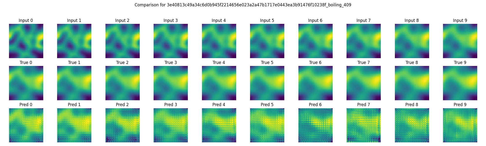

# SimVP
This is a conversion / extraction and to some extent a modification
of SimVP from the [OpenSTL Benchmark](https://github.com/chengtan9907/OpenSTL).
You can read more about SimVP [here](https://arxiv.org/abs/2206.05099) and
[here](https://arxiv.org/abs/2211.12509).

# Environment Setup
Suggestion to setup your environment like this.  Environment variables
are used here to help make it easier to swap around things for your
specific needs.

```
export MY_DESIRED_PYTHON_VERSION="3.10"
export MY_ENV_NAME='simvp'
conda deactivate
conda create -y -n $MY_ENV_NAME
conda activate $MY_ENV_NAME
conda install -y python==$MY_DESIRED_PYTHON_VERSION
```

If you need to delete the environment, perhaps if we change
requirements - you can use this:
```
conda deactivate
conda remove --name $MY_ENV_NAME --all  # answer 'y' to questions if you're sure`
```

## Do You Need NNI
[NNI](https://pypi.org/project/nni/) is used by this package, but you can
get along without it.  At least on the Mac, we don't seem to have a version of
NNI that works so comment it out of `requirements.txt` with a `#` if you're
building there.

## Installing SimVP Specific Packages
Next we'll install the SimVP specific packages.

> **Note:** Please read above re NNI.  You may need to `#` (comment out)
> NNI in the `requirements.txt`.

```
conda activate $MY_ENV_NAME
pip install --no-cache-dir -r ./requirements.txt
# if you want to visualize stuff . . .
pip install matplotlib 
```

# Generating Some Data
Currently (this isn't a great approach, I realize that) the simulation generation
is built into the SimVP package.  The code definitely *CAN* use external data, but
the examples I'll share below include ones run from this package.  So, here we go.

There are 3 basic steps to creating data - all of them take a variety of options:
1. Generating initial conditions for the modsim we want to run.  This quite
literally just generates the initial state for the simulation.
2. Running the simulation (we call that ''generating samples'').  This essentially
runs the simulation of choice some number of iterations / time steps and outputs
intermediate steps.
3. Generating datasets we can use with our data loaders in PyTorch.

Let's go through each of these steps in turn:

## Generating Initial Conditions
Again, there are many options, we'll just do something simple here to start.  Feel
free to use `--help` to look at options.

```
python ./gen_initials.py --simulation Boiling --datafolder ./data_boiling --num_initials 10 --image_height 32 --image_width 32
```

This will create 10, 32x32 initial condition images for the Boiling Water "simulation"
and place them into the directory `./data_boiling`.  Adjust as necessary.

Note that we use a unique experiment hex ID which you will likely find obnoxious
(and long) but we find very important for tracking experiments.  Because of this
randomness, I can't tell you precisely what the directory names will be.  You 
will get something that looks a bit like this:

```
ls ./data_boiling/
1e7e3e039d708148d029f601213983794d5e00fd62b962691be86cde0a7c87fe_boiling_1
36f80972ae33598c096b9743f40e40d41fa598bf21cd77e82d5176db3687d733_boiling_8
380eb6e439e5c648d6363c7f6c0b6d399b40c451fdaf816b1517fa843b6b0a54_boiling_4
43a25f7eefeae2627b409ec70c6fc74c7544cc3029dbcb32ba766b904d83a6ff_boiling_0
4e0c78cac27b881ccf56554759cf17bd814b7701afd3f7edc10c65a091e0ce12_boiling_7
64b6c84360ac588ef8512618c694cbaa118861fec2792b601504138a1ffba554_boiling_2
9c8d0141ae14132c8b76413b62ac3e112c09f68c81abdeeb5e11d322eb8984cc_boiling_5
b9d7599a826a77c87c6bd08cad37c8b22cf59ba12c1d17cb22b62a083e1e12f7_boiling_9
f138a9e060037fde03eb01ed1001a23896e1d7c6a90b39ba1c42afa8c502acf6_boiling_3
f64c70c8cba367b08cddb456eab39b9d27489a92cda1b120bf3ac786a93248a6_initials.json
f740e5c4530457fa928fc790986e00345d213631f38d913790701360dd7b93f1_boiling_6
```

If you look in one of those dirs, you'll see `0.npy` (the initial condition)
and you can open that up and look at the 32x32 "image" if you'd like.

## Running the Simulation
Please remember, these "simulations" are very *VERY* simple, they are used to
allow us to explore and create datasets of variable size very quickly.
This entire workflow does work with real modsims, so feel free to replace
this with real datasets if you wish.

```
python ./gen_samples.py --datafolder ./data_boiling --total_sample_length 100 --normalize
```

This will take all the subdirs in `./data_boiling`, pick up their initial condition,
and run the simulation for 100 time steps.  We like the `--normalize` option, but you can
play with it.  If you look at the directories now, you'll see `0.npy -> 99.npy`.

## Generating Data Loaders
OK now we'll build some data loaders for PyTorch!  Let's start with a really
small one so we can understand what we're looking at:

`python ./prep_loaders.py --datafolder ./data_boiling --num_samples 5 --sample_start_index -1 --total_length 3`

OK let's break this down.  First of all, this will create a file such as:
`./data_boiling/015af08945eb8be3c70f5014b9cdf49e3e18dc05aa6185f5cdbcd85b2ed91c93_loaders.json`.  Let's
open it and check it out.

This is JSON structured data.  Notice we pulled in 5 samples - each of 3 length (3 consecutive numpy
files).  Notice they are random where these start (that's the `--sample_start_index -1` part).


## Running a More Realistic Workflow
OK so now that we did a simple one, let's do a "real" one - with 500 simulations:

```
python ./gen_initials.py --simulation Boiling --datafolder ./data_boiling --num_initials 500 --image_height 32 --image_width 32
python ./gen_samples.py --datafolder ./data_boiling --total_sample_length 100 --normalize
python ./prep_loaders.py --datafolder ./data_boiling --num_samples 50 --sample_start_index -1 --total_length 3
```

This'll create 50 elements the data loader, broken into train/val/test, and each of them are 3 length.  Notice
that since our original dataset had 500, 100 length samples, this will pick exactly 50 of those 500 (each pulling
only 3 images from that dataset).  The way it's currently implemented, if you pick a number > than are
in that directory, it won't pick directories it has already sampled from.

Let's say we want to do a 10 input, 10 output predictor for our ML model training later - how
might we do that?

Let's try this!  We don't have to recreate the data - just the loaders!

```
python ./prep_loaders.py --datafolder ./data_boiling --num_samples 400 --sample_start_index -1 --total_length 20
```

## Visualizing Some Data
Check the `visualize_numpy.py` program if you want to visualize some of
the data you just generated.  You can just pass a base directory
and it will pick a random file from it, else you can provide a specific
one chosen.

For instance:
```
No filename given - randomly chosen file: ./data_boiling/b46acc45e2f7f12e8eeb5e32339bbb1c95baaa813c5e472b8e63e8774c18202c_boiling_333/85.npy
python ./visualize_numpy.py ./data_boiling
```

See `--help` to look at options, including saving the resultant image.

# Training the ML Model
Now that we have the data loaders, we can train a SimVP model on it.  Let's do it!

SimVP has a distributed and serial versions of the python programs, so for this simple
test we're going to use `train_simvp_standalone.py`.  You can see the options with `--help`.
Below, we're going to use some very basic things to get it going.

## Which Loader?
OK so let's pick the 50 samples loader we generated above.  Since we have this hash string,
I can't guarantee to you that the string below is the same on my machine as your's.  So let's
do this:

> **Note**: Make sure you replace the string below with the loader you built above on your
> machine

```
export MY_LOADER='./data_boiling/76dd1dd95b0990f1e364a48b284e531b035ed92ad96e4a61aa91ae086ac86b0b_loaders.json'
```

## Test Running Training a Model
Let's try it with some simple options:

Understand that, to run this on a mac / non-GPU / non-CUDA we have to VASTLY adjust
the model - so try not and focus on the loss and accuracy of the model, just note
that even for this crappy model it *is* learning - we can see the SSIM increase
and the loss decrease.

```
export LOCAL_RANK=0  # for now, we have to do this, it's a bug in our code
python ./train_simvp_standalone.py --datafile_in $MY_LOADER --pre_seq_length 10 --aft_seq_length 10 --epoch 10 --batch_size 2 --val_batch_size 2 --device cpu --config_file ./configs/SimVP_super_simple.py
```

You might get a result that looks sort of like this:

```
. . .
Epoch: 9/10, Steps: 140 | Lr: 0.0000488 | Train Loss: 0.0301789 | Vali Loss: 0.0358254
val ssim: 0.3985464087105036, mse: 36.68523406982422, mae: 129.8966064453125, rmse: 5.791803359985352, psnr: 63.43033218383789

Epoch: 10/10, Steps: 140 | Lr: 0.0000000 | Train Loss: 0.0302097 | Vali Loss: 0.0354943
val ssim: 0.40610307019547975, mse: 36.34614944458008, mae: 128.48306274414062, rmse: 5.762585639953613, psnr: 63.480430603027344

Training time: 54.0 seconds
>>>>>>>>>>>>>>>>>>>>>>>>>>>>>>>>>>> testing Debug  <<<<<<<<<<<<<<<<<<<<<<<<<<<<<<<<<<<
Loading model from work_dirs/Debug/simvp_model.pth
ssim: 0.3914077803882872, mse: 36.18033218383789, mae: 128.90582275390625, rmse: 5.855959415435791, psnr: 63.15140914916992
Total time: 55.0 seconds
```

## Running a Trained Model in Inference
OK now that we've trained a (presumably shitty / quick and dirty) model, let's run
it forward in inference mode and take a look at what it produces!

First, we run the model in inference mode.  It's important to understand this is using our same loader, but
recall that since when we built that loader we included a train/val/test split, this picks up the
`test` portion of that json.  So these *ARE* sets of data that were not included in train/val.

```
python ./test_simvp_standalone.py --datafile_in $MY_LOADER --pre_seq_length 10 --aft_seq_length 10 --device cpu --config_file ./configs/SimVP_super_simple.py
```

You'll see a (presumably, if you're following along) very quick (because of how simple of a model we're testing)
run of the saved model.  The SSIM should be pretty god awful (below, I get 0.39 out of a possible 1.0 / best score):

```
. . .
>>>>>>>>>>>>>>>>>>>>>>>>>>>>>>>>>>> testing Debug  <<<<<<<<<<<<<<<<<<<<<<<<<<<<<<<<<<<
Loading model from work_dirs/Debug/simvp_model.pth
ssim: 0.3922913267507359, mse: 36.1119270324707, mae: 128.61907958984375, rmse: 6.005255699157715, psnr: 62.669097900390625
```

Let's take a look at what it created.  Notice it named the experiment `Debug` (that's the
default, but one can certainly specify that on the command line above).

You'll now have a `work_dirs/Debug/saved/` dir that looks something like this:

```
ls work_dirs/Debug/saved
inputs      metrics.npy preds       trues
```

Next let's visualize that with `visualize_grid.py`.
To do that, we need to know a subdirectory we want to visualize, that's a bit hard for
me to do here because it's a random hash value, so check: `ls ./work_dirs/Debug/saved/inputs/` and just
pick one of them - for instance: `3e40813c49a34c6d0b945f2214656e023a2a47b1717e0443ea3b91476f10238f_boiling_409`.

Note that `inputs` are the 10 (in our case, because of `pre_seq_length`, you remember that right, from
above?) input frames that went into this.  `trues` are the True next 10 (`aft_seq_length`) values that
we're asking to be predicted as output.  Then, `preds` are the predictions - **that's our model running
in inference mode!!**.

So we can run something like this:

```
python ./visualize_grid.py ./work_dirs/Debug/saved 3e40813c49a34c6d0b945f2214656e023a2a47b1717e0443ea3b91476f10238f_boiling_409 --save
```

You'll now get:
`Grid image saved as grid_3e40813c49a34c6d0b945f2214656e023a2a47b1717e0443ea3b91476f10238f_boiling_409.png`.

Here's what that looks like for me.  You'll see it's not half bad, for a tiny model run on a Mac
with only 10 epochs of training.


